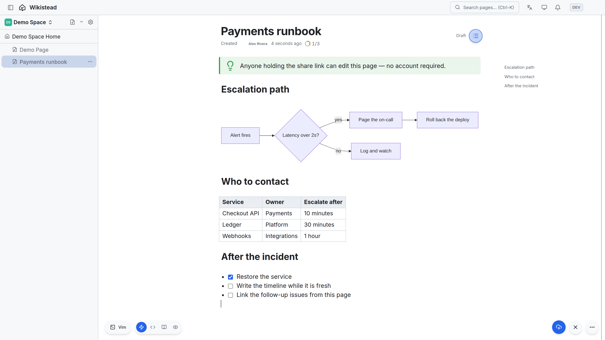
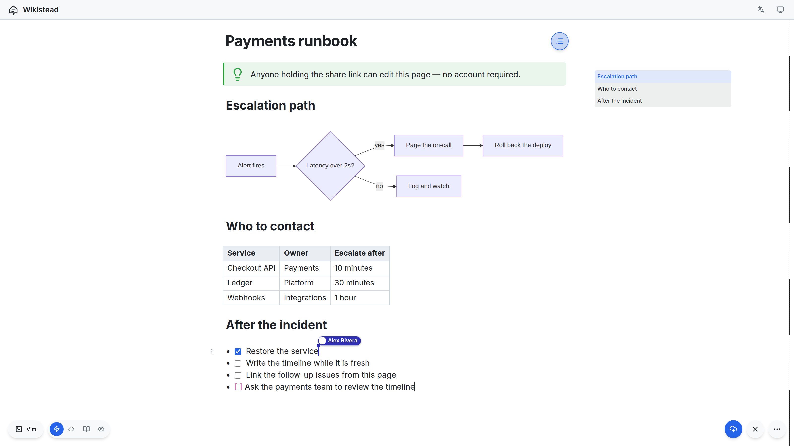

<div align="center">


# Wikistead

**A self-hostable collaborative knowledge base.**

Markdown-first, real-time, and open to people who don't have an account.

[Self-hosting](docs/self-hosting.md) · [API reference](docs/api-reference.md) · [Contributing](CONTRIBUTING.md) · [Security](SECURITY.md)

</div>

<br>



## What makes it different

Send someone a share link and they can **edit with you immediately** — no account, no invitation,
no billing seat. A guest holds a short-lived token bound to exactly one page or space; revoking it
is a single operation, and the link can carry an expiry and a password.

Everything is written on **one live-preview surface** over a single CRDT document. Diagrams, tables
and callouts render where you type them while the source underneath stays plain Markdown, so what
you export is what you wrote. Vim users get a real vim mode on that same surface — a keymap toggle,
not a separate editor.



## Features

- **Anonymous real-time co-editing** through share links — time-limited, password-protectable, revocable in one operation.
- **One Markdown surface.** Live preview and source are the same editor; no block format to convert into and out of.
- **Real vim mode** — a keymap toggle, with ex commands and blockwise visual selection.
- **Rich blocks that stay Markdown**: Mermaid, Excalidraw, PlantUML (rendered by a service you run, off by default), KaTeX math, tables, callouts, columns, tabs, details, task lists, page transclusion and embeds.
- **Permissions with real depth** — space-to-page inheritance, per-page overrides, groups and roles, backed by OpenFGA.
- **Search that can't leak** — hits are filtered by what the viewer may see and confirmed again before they are shown.
- **History** — revisions, diffs and restore.
- **Publishing** — pages and spaces can be made public, off by default for the whole tenant.
- **Comments, mentions, watches and notifications.**
- **Nothing is trapped inside** — export a page as Markdown or HTML, or a whole space as an archive you can import back.
- **An API and an MCP endpoint** — scoped API keys, and assistants that read and write pages under the same permission checks a person gets.
- **Multi-tenant** — one deployment serves many tenants, isolated at the database.
- **English and Japanese.**

## Getting started

```bash
git clone https://github.com/wikistead/wikistead.git && cd wikistead
cp .env.example .env                          # two secrets are mandatory; the server won't boot without them
cp apps/web/.env.example apps/web/.env.local
pnpm install
pnpm dev:up                                   # middleware + first-run bootstrap (safe to re-run)
docker compose --profile apps up -d --build   # web, server and collab
```

**[docs/self-hosting.md](docs/self-hosting.md)** is the full guide: the secrets to generate, single-host
Docker Compose and what production needs beyond it, reverse-proxy and TLS rules, the configuration
reference, and how to create the first tenant and get into it.

## How it is built

TypeScript throughout — Fastify on the server, React and CodeMirror 6 on the web, Yjs and Hocuspocus
for realtime. Postgres holds the documents, OpenFGA answers every permission question, Meilisearch
serves search, Valkey carries realtime fan-out, and attachments go to any S3-compatible store
(SeaweedFS by default, swappable for R2 or S3).

## Contributing

Wikistead has a [Code of Conduct](CODE_OF_CONDUCT.md). **Security issues** must go through the
private channel described in [SECURITY.md](SECURITY.md) — never a public issue.

Bug reports and feature ideas are very welcome as [issues](.github/ISSUE_TEMPLATE/). External pull
requests are **not accepted at this time**; [CONTRIBUTING.md](CONTRIBUTING.md) explains why, and how
to build and run the project from source.

## License

The Community Edition — this repository — is **AGPL-3.0**. Enterprise features are proprietary and
live outside this source. Every bundled dependency is permissive (MIT / Apache-2.0 / BSD / ISC), so
nothing copyleft is linked into a distributable; CI enforces that on every change.
