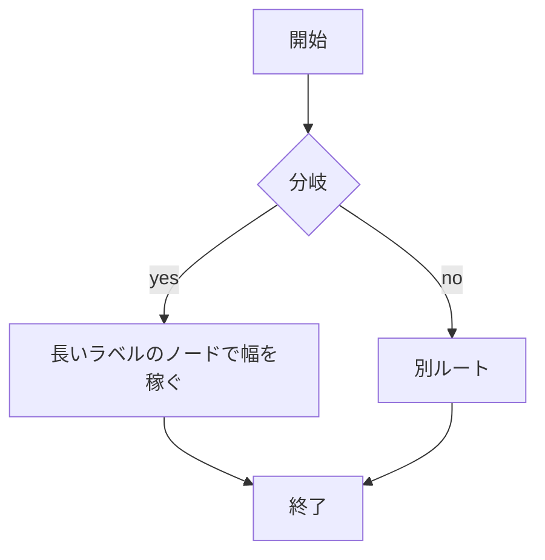
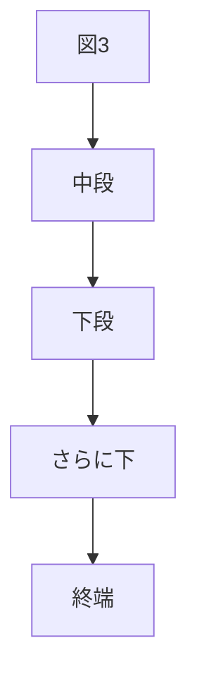

# 描画QA：拷問ページ
過去に壊れた描画パターンの全部盛り。**各セクションの冒頭に期待挙動**を書いてある。Live / Reading / view / 公開 / 印刷で随時確認する。

## 1. ネスト directive（外側が途中で閉じないこと・全 nested が描画されること）
期待：タブ2枚とも見える・`:::` が本文に漏れない・タブ内の callout に箱（tint＋色バー）が付く・タブ内の表が罫線付き。

::::tabs
:::tab[タブ1]
タブ1本文。**bold** と `code`。
:::
:::tab[タブ2（初期非表示）]



| 列A | 列B | 列C |
| - | - | - |
| ネスト表 | 1 | 2 |

:::warning[タブ内 callout]
箱・アイコン・ラベル色が editor 外でも付くこと。
:::
:::
::::

## 2. 連続する tall mermaid ×3（初回レンダリング・motion・高さドリフト）
期待：3 つとも初回表示でレンダリングされる（クリックで初めて出る、はバグ）。vim の j/k が各図を 1 ストップで跨ぐ。




## 3. 素のタスクリスト（checkbox）
期待：edit で押せる。view でも押せる（※現在 #300 の既知バグで view は無効＝直ったらここで確認）。Enter で `- [ ]` が継続する。
- [x] 済みタスク
- [ ] 未タスク
  - [ ] ネストタスク
1. [ ] ordered タスク

## 4. 数式（display atom・motion）
期待：ブロック数式がレンダリングされ、j/k で 1 ストップ。インライン数式 $e^{i\pi}+1=0$ が文中に出る。
$$
\int_0^\infty e^{-x^2} dx = \frac{\sqrt{\pi}}{2}
$$

## 5. コードフェンス属性（#198）
期待：ファイル名タブ・行番号・2行目ハイライト。コピーで中身だけコピーされる。
```ts title=example.ts {2}
const a = 1;
const highlighted = 2; //
const c = 3;
```

## 6. リンク
期待：外部リンクが自動リンク・内部リンクが遷移可・**デッドリンク**（下）はクリックで「見つかりません」（#276 が入れば打ち消し表示）。
外部: https://example.com/path?q=1
内部（自分）: [このページ](/p/c985270e-ec4c-4aab-a3a6-a582072ecd93)
デッド: [消されたページ](/p/00000000-0000-0000-0000-000000000000)

## 7. 画像（#255：単独行は中央・インラインは流れのまま）
期待：次の単独画像が**中央**に出る。

この行のインライン画像  は文中に**小さく**混ざり、中央化されない。

## 8. XSS カナリア（すべて無害なテキスト/無反応であること）
期待：ダイアログが出ない・画像もスクリプトも実行されない・そのまま文字として見えるだけ。
<script>window.__torture=1</script>

[js リンク](javascript:alert(1))

| セル内 |  |
| - | - |
| a | b |

## 9. 幅と折返し
期待：横長の表はページ全体でなく**表だけが横スクロール**。長い単語は折り返す。
| c1 | c2 | c3 | c4 | c5 | c6 | c7 | c8 | c9 | c10 | c11 | c12 |
| - | - | - | - | - | - | - | - | - | - | - | - |
| 長めのセル内容 | b | c | d | e | f | g | h | i | j | k | l |

longwordxxxxxxxxxxxxxxxxxxxxxxxxxxxxxxxxxxxxxxxxxxxxxxxxxxxxxxxxxxxxxxxxxxxxxxxxxxxxxxxxxxxxxxxxxxxxxxxxxxxxxxxxxxxxxxxxxxxxxxxx

## 10. 引用と区切り
> 引用 1 段
>> 引用 2 段（ネスト）

---

## 11. 図系のその他
期待：excalidraw は空プレースホルダ（クリックで開く）。plantuml はレンダラ未設定なら**ソースに degrade**（エラーにならない）。
```excalidraw
```

```plantuml
Alice -> Bob: hello
```

## 12. 絵文字・結合文字・CJK 混在見出し 🎌
テキスト: 👨‍👩‍👧‍👦 家族絵文字（ZWJ）・が゙（結合濁点）・ｱｲｳ半角カナ。

おわり（このページは常設 QA 用・消さない）

